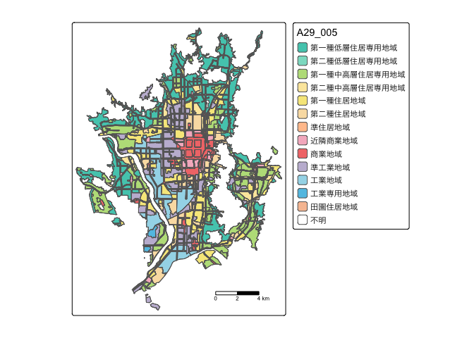

<!-- README.md is generated from README.Rmd. Please edit that file -->

# geojp

<!-- badges: start -->

[](https://zenodo.org/doi/10.5281/zenodo.10205233)
<!-- badges: end -->

The goal of geojp is to provide an easy access to various geographical
data of Japan.

## Installation

You can install the development version of geojp from
[GitHub](https://github.com/) with:

``` r
install.packages("devtools")
devtools::install_github("babayoshihiko/geojp")
```

Load (attach) package **geojp**.

``` r
library(geojp)
```

## Census

Load census boundary information. Specify the prefecture code
(code_pref) and municipality code (code_muni). Here is an example for
Osaki City (215) in Miyagi Prefecture (4).

``` r
sfCensus <- geojp::read_census_tract(code_pref = 4, code_muni = 215)
head(sfCensus)
```

    #> Simple feature collection with 6 features and 5 fields
    #> Geometry type: POLYGON
    #> Dimension:     XY
    #> Bounding box:  xmin: 140.9491 ymin: 38.57324 xmax: 140.965 ymax: 38.57924
    #> Geodetic CRS:  JGD2000
    #> # A tibble: 6 × 6
    #>   KEY_CODE     AREA PERIMETER JINKO SETAI                               geometry
    #>   <chr>       <dbl>     <dbl> <dbl> <dbl>                          <POLYGON [°]>
    #> 1 042150010  42064.      976.   215    59 ((140.9586 38.57839, 140.9582 38.5786…
    #> 2 042150020  21813.      896.    88    42 ((140.9568 38.57566, 140.9567 38.5757…
    #> 3 042150030  66933.     1286.   176    68 ((140.9625 38.57528, 140.9623 38.5753…
    #> 4 042150040  52498.     1233.   156    69 ((140.9605 38.57737, 140.9603 38.577,…
    #> 5 042150050  75934.     1390.   205   107 ((140.9574 38.57757, 140.9568 38.5778…
    #> 6 042150060 133863.     1574.   490   191 ((140.9548 38.57702, 140.9547 38.5771…

The census has many columns, so only the important ones have been cut
out.

Ordinance-designated cities will be in units of administrative
districts. The `read_census_odcity()` function returns all the wards
with the name of the ordinance-designated city.

``` r
sfCensus2 <- geojp::read_census_odcity("京都市")
head(sfCensus2)
```

    #> Simple feature collection with 6 features and 5 fields
    #> Geometry type: POLYGON
    #> Dimension:     XY
    #> Bounding box:  xmin: 135.7368 ymin: 35.04067 xmax: 135.7477 ymax: 35.05123
    #> Geodetic CRS:  JGD2000
    #> # A tibble: 6 × 6
    #>   KEY_CODE       AREA PERIMETER JINKO SETAI                             geometry
    #>   <chr>         <dbl>     <dbl> <dbl> <dbl>                        <POLYGON [°]>
    #> 1 26101001001  55664.     1272.   335   159 ((135.7431 35.04654, 135.743 35.046…
    #> 2 26101001002  41500.     1040.    96    44 ((135.7403 35.0478, 135.7398 35.047…
    #> 3 26101001003  49730.      951.   807   435 ((135.7388 35.04569, 135.7394 35.04…
    #> 4 26101001004 289781.     2896.   867   407 ((135.7471 35.04318, 135.747 35.043…
    #> 5 26101001005  52556.     1120.   941   424 ((135.7477 35.04751, 135.7477 35.04…
    #> 6 26101001006  46270.     1051.   449   264 ((135.7473 35.05072, 135.7474 35.05…

Additional attribute information is set. Attributes are obtained using
the `attr()` function. One particularly important attribute is the
source. The source can be retrieved as follows

``` r
attr(sfCensus2, "sourceName")
#> [1] "「政府統計の総合窓口(e-Stat)」"
attr(sfCensus2, "sourceURL")
#> [1] "https://www.e-stat.go.jp/gis/"
```

## National Land Information

Load the zoning information from the National Land Information. Specify
the prefecture code (code_pref) and municipality code (code_muni). The
2011 and 2019 versions are available, so we will try the 2011 version
this time.

For more information about the National Land Information, see [National
Land Information Download
Service](https://nlftp.mlit.go.jp/ksj/index.html).

The return value is an `sf` object.

``` r
sfYouto <- geojp::read_landnuminfo_landuse(code_pref = 26, code_muni = 100, year = 2019)
```

The `A29_004` and `A29_005` columns, which indicate the zoning class,
are of type factor.

``` r
levels(sfYouto$A29_005)
#>  [1] "第一種低層住居専用地域"   "第二種低層住居専用地域"  
#>  [3] "第一種中高層住居専用地域" "第二種中高層住居専用地域"
#>  [5] "第一種住居地域"           "第二種住居地域"          
#>  [7] "準住居地域"               "近隣商業地域"            
#>  [9] "商業地域"                 "準工業地域"              
#> [11] "工業地域"                 "工業専用地域"            
#> [13] "田園住居地域"             "不明"
```

Additional attribute information is set. Attributes are obtained using
the `attr()` function. One particularly important attribute is the
source. The source can be retrieved as follows

``` r
attr(sfYouto, "sourceName")
#> [1] "「国土数値情報（行政区域データ）」（国土交通省）"
attr(sfYouto, "sourceURL")
#> [1] "https://nlftp.mlit.go.jp/ksj/gml/datalist/KsjTmplt-A29-v2_1.html"
```

The attribute “col” is the column name used for color separation. The
attribute “palette” is the color palette for color separation. This is
matched as closely as possible to the colors of the intended use area
according to the Japanese Industrial Standards (JIS).

``` r
attr(sfYouto, "palette")
#>  [1] "#00BEA9" "#6AD5BD" "#A8D666" "#FAE294" "#F4E268" "#F8D79C" "#FFB580"
#>  [8] "#F3A5B9" "#EE534F" "#B3A8CB" "#8AD0E4" "#2CB3DE" "#F4B187" "#FFFFFF"
```

## tmap

Use package **tmap** to display the usage area. The last font
specification is required only for macOS.

``` r
library(tmap)
#> 
#> Attaching package: 'tmap'
#> The following object is masked from 'package:datasets':
#> 
#>     rivers
# Create a map.
myTm <- tm_shape(sfYouto) +
          tm_polygons(fill = attr(sfYouto, "col"), 
                      palette = attr(sfYouto, "palette"), alpha = 0.8) + 
           tm_borders()
#> Deprecated tmap v3 code detected. Code translated to v4
myTm <- myTm +
      tm_scale_bar() +
      tm_layout(tm_title = "京都市",
                legend.text.fontfamily = "HiraginoSans-W3")
#> Warning: As of version 4.0, tm_scale_bar has been renamed to tm_scalebar and is
#> therefore deprecated
```

Display the plot.

``` r
myTm
```



To save, use the `tmap_save()` function.

``` r
tmap_save(tm = myTm, filename = "map.png")
```

You can also superimpose census and zoning maps.

In addition, you can use The Geospatial Information Authority of Japan
standard map in tiled format as a base map.

<https://maps.gsi.go.jp/development/ichiran.html>

``` r
library(tmap)
tmap_mode("view")
#> tmap mode set to 'view'
# Create a map.
myTm <- tm_shape(sfCensus2) +
          tm_polygons("JINKO", alpha = 0.8) 
#> Deprecated tmap v3 code detected. Code translated to v4
myTm <- myTm +
          tm_shape(sfYouto) +
          tm_polygons(fill = attr(sfYouto, "col"), 
                      palette = attr(sfYouto, "palette"), alpha = 0.8) + 
           tm_borders()
#> Deprecated tmap v3 code detected. Code translated to v4
myTm <- myTm +
      tm_basemap(server = "https://cyberjapandata.gsi.go.jp/xyz/std/{z}/{x}/{y}.png")
myTm <- myTm +
      tm_scale_bar() +
      tm_layout(tm_title = "京都市",
                legend.text.fontfamily = "HiraginoSans-W3")
#> Warning: As of version 4.0, tm_scale_bar has been renamed to tm_scalebar and is
#> therefore deprecated
myTm
```

## mapview

``` r
library(mapview)
mapviewOptions(fgb = FALSE) # needed when creating web pages
mapview(sfYouto[attr(sfYouto, "col")], col.regions = attr(sfYouto, "palette"), fgb = FALSE)
```
