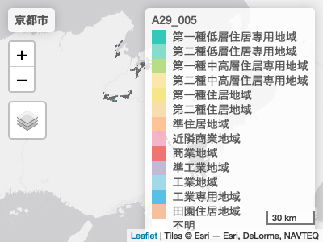

<!-- README.md is generated from README.Rmd. Please edit that file -->

# geojp

<!-- badges: start -->
<!-- badges: end -->

The goal of geojp is to provide an easy access to various geographical
data of Japan.

## Installation

You can install the development version of geojp from
[GitHub](https://github.com/) with:

``` r
# install.packages("devtools")
devtools::install_github("babayoshihiko/geojp")
```

## パッケージのインストールと読み込み

これは最初だけ必要です。ただし、まだ
開発途中ですので、定期的に繰り返すと良いでしょう。

``` r
install.packages("devtools")
devtools::install_github("babayoshihiko/geojp")
```

パッケージ **geojp** を読み込み (attach) ます。

``` r
library(geojp)
```

## 国勢調査

国勢調査の境界情報を読み込みましょう。都道府県コード (code_pref)
と市町村コード (code_muni) を指定します。宮城県 (4) の大崎市 (215)
の例です。

``` r
sfCensus <- geojp::read_census_tract(code_pref = 4, code_muni = 215)
head(sfCensus)
#> Simple feature collection with 6 features and 5 fields
#> Geometry type: POLYGON
#> Dimension:     XY
#> Bounding box:  xmin: 140.9491 ymin: 38.57324 xmax: 140.965 ymax: 38.57924
#> Geodetic CRS:  JGD2011
#> # A tibble: 6 × 6
#>   KEY_CODE     AREA PERIMETER JINKO SETAI                               geometry
#>   <chr>       <dbl>     <dbl> <dbl> <dbl>                          <POLYGON [°]>
#> 1 042150010  42064.      976.   215    59 ((140.9586 38.57839, 140.9582 38.5786…
#> 2 042150020  21813.      896.    88    42 ((140.9568 38.57566, 140.9567 38.5757…
#> 3 042150030  66933.     1286.   176    68 ((140.9625 38.57528, 140.9623 38.5753…
#> 4 042150040  52498.     1233.   156    69 ((140.9605 38.57737, 140.9603 38.577,…
#> 5 042150050  75934.     1390.   205   107 ((140.9574 38.57757, 140.9568 38.5778…
#> 6 042150060 133863.     1574.   490   191 ((140.9548 38.57702, 140.9547 38.5771…
```

国勢調査は、列数が多いので、重要なものだけ切り取ってあります。

政令指定都市は、行政区単位になってしまいます。`read_census_odcity()`
関数は、政令指定都市名を指定して全ての区を返します。

``` r
sfCensus2 <- geojp::read_census_odcity("京都市")
head(sfCensus2)
#> Simple feature collection with 6 features and 5 fields
#> Geometry type: POLYGON
#> Dimension:     XY
#> Bounding box:  xmin: 135.7368 ymin: 35.04067 xmax: 135.7477 ymax: 35.05123
#> Geodetic CRS:  JGD2011
#> # A tibble: 6 × 6
#>   KEY_CODE       AREA PERIMETER JINKO SETAI                             geometry
#>   <chr>         <dbl>     <dbl> <dbl> <dbl>                        <POLYGON [°]>
#> 1 26101001001  55664.     1272.   335   159 ((135.7431 35.04654, 135.743 35.046…
#> 2 26101001002  41500.     1040.    96    44 ((135.7403 35.0478, 135.7398 35.047…
#> 3 26101001003  49730.      951.   807   435 ((135.7388 35.04569, 135.7394 35.04…
#> 4 26101001004 289781.     2896.   867   407 ((135.7471 35.04318, 135.747 35.043…
#> 5 26101001005  52556.     1120.   941   424 ((135.7477 35.04751, 135.7477 35.04…
#> 6 26101001006  46270.     1051.   449   264 ((135.7473 35.05072, 135.7474 35.05…
```

## 国土数値情報

国土数値情報の用途地域を読み込みましょう。都道府県コード (code_pref)
と市町村コード (code_muni)
を指定します。平成23（2011）年度、令和元（2019）年度があるので、今回は平成23年度版を試します。

国土数値情報については、[国土数値情報ダウンロードサービス](https://nlftp.mlit.go.jp/ksj/index.html)
を参照。

返り値は `sf` オブジェクトです。

``` r
sfYouto <- geojp::read_landnuminfo_landuse(code_pref = 26, code_muni = 100, year = 2011)
#> Warning in unzip(strLNIZip, files = SHPFiles, exdir = strTempDir): zip ファイル
#> 中には、要求されたファイルは存在しません
#> Warning in st_collection_extract.sf(sfLNI, type = "POLYGON"): x is already of
#> type POLYGON.
```

用途地域クラスを示す `A29_004` と `A29_005` 列は、因子型(factor)
になっています。

``` r
levels(sfYouto$A29_005)
#>  [1] "第一種低層住居専用地域"   "第二種低層住居専用地域"  
#>  [3] "第一種中高層住居専用地域" "第二種中高層住居専用地域"
#>  [5] "第一種住居地域"           "第二種住居地域"          
#>  [7] "準住居地域"               "近隣商業地域"            
#>  [9] "商業地域"                 "準工業地域"              
#> [11] "工業地域"                 "工業専用地域"            
#> [13] "田園住居地域"             "不明"
```

追加の属性情報を設定しています。属性は、`attr()`
関数を使って取得します。特に重要な属性として、出典があります。出典は、以下のように取得することができます。

``` r
attr(sfYouto, "sourceName")
#> [1] "「国土数値情報（用途地域データ）」（国土交通省）"
attr(sfYouto, "sourceURL")
#> [1] "https://nlftp.mlit.go.jp/ksj/gml/datalist/KsjTmplt-A29-v2_1.html"
```

属性 “col” は、色分けの際に使用する列名です。属性 “palette”
は、色分け用のカラーパレットです。これは、日本工業規格（JIS）に基づいた用途地域の色にできる限り合わせてあります。

``` r
attr(sfYouto, "palette")
#>  [1] "#00BEA9" "#6AD5BD" "#A8D666" "#FAE294" "#F4E268" "#F8D79C" "#FFB580"
#>  [8] "#F3A5B9" "#EE534F" "#B3A8CB" "#8AD0E4" "#2CB3DE" "#F4B187" "#FFFFFF"
```

## tmap

パッケージ **tmap**
を使って、用途地域を表示してみましょう。最後のフォント指定は、macOS
のみ必要です。

``` r
library(tmap)
# Create a map.
myTm <- tm_shape(sfYouto) +
          tm_polygons(col = attr(sfYouto, "col"), palette = attr(sfYouto, "palette"), alpha = 0.8) + 
           tm_borders()
myTm <- myTm +
      tm_scale_bar() +
      tm_layout(title = "京都市",
                legend.outside = FALSE, 
                fontfamily = "HiraginoSans-W3")
```

プロットを表示しましょう。

``` r
myTm
#> Warning: One tm layer group has duplicated layer types, which are omitted. To
#> draw multiple layers of the same type, use multiple layer groups (i.e. specify
#> tm_shape prior to each of them).
```


保存する場合は、`tmap_save()` 関数を使います。

``` r
tmap_save(tm = myTm, filename = "map.png")
```

国勢調査と用途地域を重ね合わせることもできます。

``` r
library(tmap)
tmap_mode("view")
#> tmap mode set to interactive viewing
# Create a map.
myTm <- myTm +
          tm_shape(sfCensus2) +
          tm_polygons("JINKO", alpha = 0.8) 
myTm <- tm_shape(sfYouto) +
          tm_polygons(col = attr(sfYouto, "col"), palette = attr(sfYouto, "palette"), alpha = 0.8) + 
           tm_borders()
myTm <- myTm +
      tm_scale_bar() +
      tm_layout(title = "京都市",
                legend.outside = FALSE, 
                fontfamily = "HiraginoSans-W3")
myTm
#> Warning: One tm layer group has duplicated layer types, which are omitted. To
#> draw multiple layers of the same type, use multiple layer groups (i.e. specify
#> tm_shape prior to each of them).
```



## mapview

``` r
library(mapview)
mapviewOptions(fgb = FALSE) # needed when creating web pages
mapview(sfYouto[attr(sfYouto, "col")], col.regions = attr(sfYouto, "palette"), fgb = FALSE)
```


